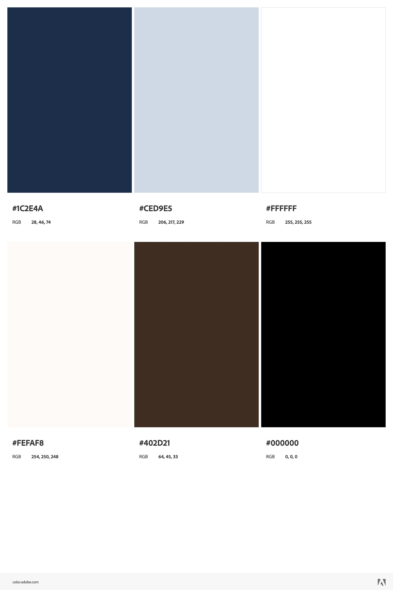

# README

## By: Pipatporn Chaluthong 

## Netlify Status Badge

## Header (Navbar)

## Hero (Main)

## Bio (About Me)

## Gallery (My Artwork)

## Lit (My Blog)

## Video (My Video)

## Contact (Contact Me)

## Footer

## Color Scheme

## Citation

Gallery Section Hover Effect and an Icon
- https://fooplugins.com/thumbnail-hover-effect/
- https://icons.getbootstrap.com/icons/arrow-down-circle-fill/ 

Hamburger Bar/Nav Bar on Header 
- https://www.youtube.com/watch?v=SIzi9z8mrTk

Ps. I also use the same two icons from the Video

Add Link within an Icon and an Icon on the footer
- https://www.youtube.com/watch?v=HA6bByKdAQM&list=PLP9IO4UYNF0VdAajP_5pYG-jG2JRrG72s 
- https://www.w3schools.com/html/html_links.asp
- https://icons.getbootstrap.com/icons/github/

Ps. I also use the same concept to link a section in Gallery section

Quote on Hero section
- https://www.laurajaworski.com/single-post/60-quotes-about-art-creativity-by-author-laura-jaworski 

Ideas for the blog: Hover Flip effect
- https://fooplugins.com/thumbnail-hover-effect/ 
- https://www.w3schools.com/howto/howto_css_flip_card.asp 
- https://www.codeguage.com/blog/flip-card-css 

© 2024 - Pipatporn Chaluthong
